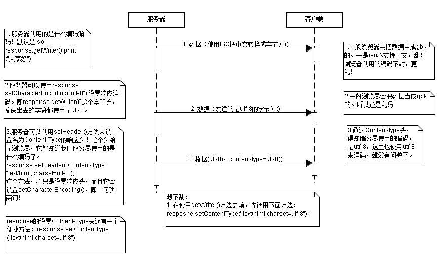
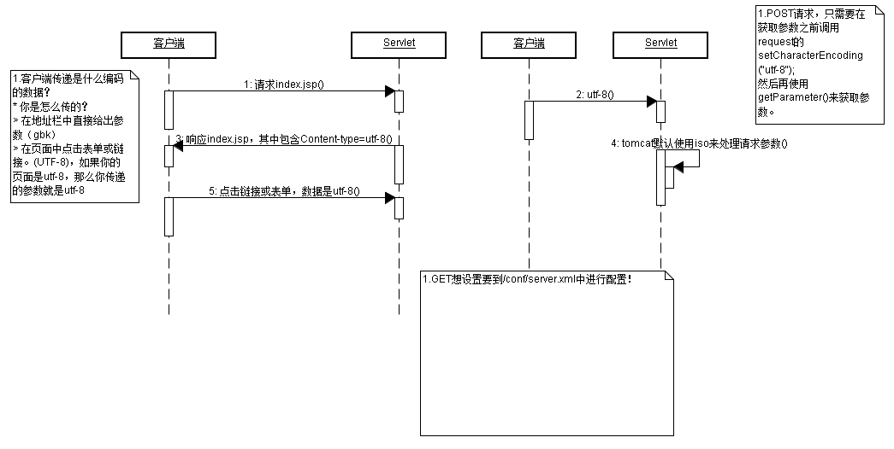
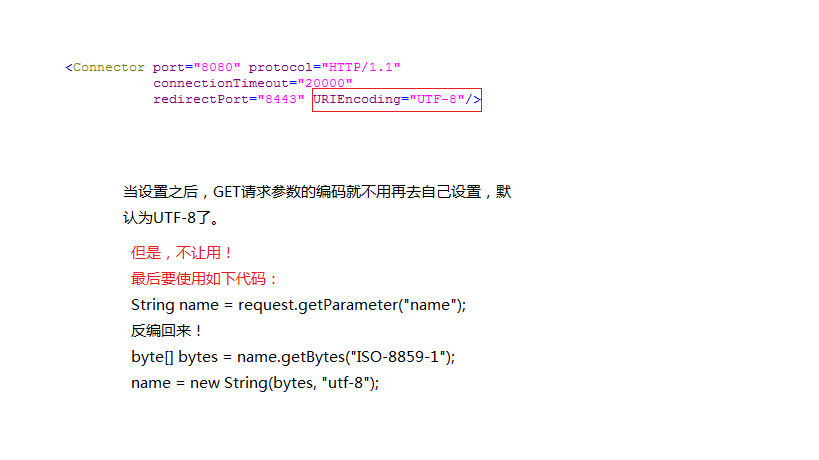

## Day04：

### 1、HTML和CSS结合的方式

 （1）每个HTML标签里都有一个属性 style属性，在该属性中设置样式

 （2）在<head>头声明中添加；

 （3）在<head>头声明中引入外部CSS文件；<u>注意：在某些浏览器中，该引入方式不起作用</u>

 （4）通过头标签<link>引入外部文件；


**优先级（一般情况）：**

-- 由上到下，由外到内，优先级由低到高。

-- ~~后加载的优先级高~~；范围越小的优先级越高；


#### 1 CSS的基本选择器

 （1）标签选择器：使用标签名作为选择器的名称；

 （2）class选择器：：为HTML标签定义一个class名称，并使用这个名称作为选择器；

	-- <div class="aaa">aaaaaa</div>
	
	在<style>标签中写上：div.aaa { ***}

 （3）id选择器：为HTML标签定义一个id名称，并使用这个名称作为选择器

	-- <div id="aaa">aaa</div>
	
	在<style>标签中写上div#id {***}


#### 2 CSS的扩展选择器

（1）关联选择器：设置嵌套标签的样式

		-- <div><p>sdkfhskd</p></div>
	
		-- 只设置里面的p标签的样式；
	
		-- div p {****}

 


（2）组合选择器

（3）伪元素选择器


#### 3 CSS中的盒子模型

	在进行布局前需要把数据封装到一块一块的区域（div）里，称作盒子；

（1）边框

（2）内边距

（3）外边距


#### 4 CSS的布局的漂浮（了解即可）


#### 5 CSS布局的定位（了解即可）

	属性值position


### 2、javascript

#### 1.  javascript的组成

（1）ECMAScript

	-- 由ECMA组织制定javascript的语法

（2）BOM

	-- 浏览器对象模型（browser object model）

（3）DOM

	-- 文档对象模型（document object model）


#### 2. js和HTML的结合方式（两种）

1. 使用一个标签,<script type="text/javascript">这里写js代码</script>；
   注意：上面的标签可以写在<body>标签里
2. 引入外部js文件：
   -- 引入语法：<script type="text/javascript"  src="写上路径"></script>
   注意：第二种（引入外部js文件）方法的标签体里面，js代码不会执行，因此，不要在标签体中写代码


#### 3. js的原始类型（五种）

	js的原始数据类型有五种：string（注意不要大写）、number、boolean、null、undefined；通过函数`typeof()`可以查看对应变量的数据类型；


#### 4. js的运算符

1. js中字符串的相加和相减的运算逻辑不一样："456" + 1 = "4561";   "456"-1 = 455；
   如果字符串中的内容不是一个数字，那么会提示"NaN";
2. js中的 true和false分别对应整数1和0
3. ==  和 === 的区别：
   == 比较值； === 比较值和类型；


#### 5. js的函数定义及调用

格式： function 函数名(参数列表) {***}

注意：参数列表中的参数不用加上`var`关键字；


#### 6. js的全局变量好局部变量

**全局变量**：在script标签里定义的一个变量，这些变量可以在页面中js部分都可以使用（包括其他部分的script标签都能使用）；

局部变量：在方法内部定义的变量


#### 7. script标签的位置

	由于HTML的解析是从上到下解析，因此，如果js文件中需要用到body标签中某个id，那么需要先解析id，再解析js代码；即：js代码放在id定义之后。
	
	建议：把<script>标签放在<body>标签的后面


**js是否存在重载？？？**


# Day 03

### 9、dom 对象

dom：文档对象模型

	-- 文档：指的是超文本标记文档
	
	-- 对象：提供了属性和方法操作
	
	-- 模型：使用属性和方法操作超文本标记型文档

即：使用dom中提供的对象里面的属性和方法，对标记型文档进行操作。

**解析过程**：

	根据html的层级结构，在内存中分配一个树形结构，需要把html中的每部分封装成对象，
	
	-- document对象： 整个文档
	
	-- element对象：标签对象；
	
	-- 文本对象：
	
	-- Node节点对象： 是上面所有对象的父对象，定义了很多方法；


# Day05

## 使用dom4j查询xml

步骤：

1. 创建解析器；
2. 得到document对象；
3. 得到根节点；（上面三步都是相对固定的）
4. 得到所有的p1标签；
5. 得到name；
6. 得到name的值；


## 使用dom4j实现添加操作

需求：在第一个p1标签末尾添加一个元素<sex></sex>

# Day 03

## 一、javascript的对象

### 1. Array 对象的push函数

	A.push(B)：往A中加入元素B，并返回加入元素A后的长度。

注意：B是一个整体，每次push之后，A的长度+1（即使B是一个数组）。


### 2、Date对象

1. getTime() 函数用于获取1970年1月1日至今的毫秒数；
   应用场景：使用毫秒数避免缓存


### 3、Math对象

	Math对象里面的函数都是静态函数，因此，不需要新建一个Math对象（实际上，也不能新建Math对象），就可以使用里面的方法；


### 4、全局函数

1. 使用encodeURL() 和 decodeURL() 分别对中文字符进行编码和解码（因为直接输出中文时会出现乱码）


### 6、js 函数的重载

js 中不存在函数的重载；相同名称的函数，前面的函数会被最后一个函数所覆盖；

传递给函数的所有参数，都会被保存到一个数组对象 arguments 中；


问：js中是否存在重载？

答：（1） js 中不存在重载；

	（2）但是可以通过其他方式实现和重载相类似的功能；（通过arguments 数组可以模拟重载的效果）


### 7、BOM对象

	BOM中有哪些对象：
	
	① navigator：获取客户机（浏览器）的名称；
	
	② screen：获取屏幕的信息（宽、高等）
	
	③ location：请求的URL地址
	
			-- href  属性（获取请求的URL旗帜、设置URL地址）
	
	④ history：请求的URL历史记录
	
	⑤ window（重要）：窗口对象、顶层对象，所有bom对象都是在window对象里操作；


### window对象中的函数

-- setInterval()

	以指定的周期执行js代码；

-- setTimerout()

	指定的时间过后执行js代码，但是只会执行一次；

-- clearInterval()

	清除setInterval设置的定时器

-- clearTimeout()

	清除setTimerout设置的定时器


### **document 对象**

	表示整个的文档

常用方法：

-- getElementById()：得到对应id的标签

```javascript
var A = document.getElementById(id名称);
通过 A.属性名称 即可访问、设置A对应的属性名称的值
```


-- getElementsByName()：通过标签的那么属性值得到标签，返回的是一个集合（数组）


-- getElementsByTagName("标签的名称")：


### **window案例**

要点：B页面需要得到A页面的id（即：需要实现跨页面操作）；可以通过当前window的opener属性得到父窗口；

	此外，如果A页面和B页面都是编写在本地的话，通过谷歌浏览器不能从A页面跳转到B页面（因为javascript的安全性问题，并且谷歌浏览器安全级别很高）；但是实际开发中不存在这种问题，因为都是页面都是部署到服务器上运行的。


**步骤**

1. 编写一个html页面，上面放置两个输入框和一个按钮；按钮上注册一个点击事件，当点击发生时，打开一个新的窗口；
2. 编写另外一个html页面，这个页面上编写一个表格，在这个表格中填入数据：4*3,一列按钮，一列编号，一列姓名；
3. 在B页面中将数据设置到A页面中。


### **element对象**

1. removeAttribute 方法不能删除 value 属性；
2. 利用 元素标签.childNodes 得到的子标签数组，在各个浏览器中存在着兼容性问题，要想获取准确的子标签对象，只能通过 元素标签.getElementsByTagName 方法来获取；


### **Node对象**

**属性**：

- nodeName：对应标签
- nodeType：对应属性
- nodeValue：对应文本
  
- 父节点：parentNode
- 子节点：childNodes可以得到所有子节点，但是兼容性很差


### 操作dom树

**appendChild方法**

	如果把元素A中的子元素A0通过该方法添加到另外一个元素B中去，那么原来的元素A将失去子元素A0（可能由于dom中各个元素只能有一个父节点）；该功能类似于剪切粘贴的操作。


**insertBefore方法**

	用法： `父节点.insertBefore(新节点，旧节点)`，可以实现在旧节点之前添加新节点，并且使得新节点同样位于父节点之下；


### innerHTMl属性

	这个属性不是dom的组成部分，同时，多数浏览器也支持这个属性；
	
	作用：① 获取文本内容； ② 往div中设置内容（可以是HTML代码）


注：javascript编写习惯：每写一行javascript代码，就观察一下该代码的效果（因为Javascript不是编译型语言）


注意：Day07中的jdk5.0新特性没有看；


## Day 08

### 一、Tomcat

- Tomcat的启动需要在环境变量中设置`JAVA_HOME`;
- WEN-INF目录下的文件不允许浏览器直接访问！


### 二、HTTP协议

	HTTP协议包括请求协议和响应协议，其中，请求协议由客户端的浏览器发送，而响应协议则由服务器发送；


请求协议的格式如下：

```
请求行
头信息：由头名称+头值组成
空行
请求体
```

注意：GET请求没有请求体！但是必须有空行；


响应协议的格式如下：

```
响应行（协议/版本 状态吗 状态吗解析） **注意：状态吗首个数字定义了各种状态
响应头（key/value格式）
空行
响应正文（响应体）
```


表单中的url编码：

	如果是中文，那么先把中文的每个汉字对应转换成三个字节（在utf-8的编码格式下），得到三个数值a~1~、a~2~、a~3~；接着分别将各个数值+128，得到新的三个数值，最后转换成16进制


Refer头

作用：① 统计访问量； ② 防止盗链

原理：根据当前的请求头来判断


状态码：

- 200：请求成功；
- 404：请求的资源没有找到；
- 500：请求的资源找到了，但是服务器内部出现了错误；
- 302重定向，需要浏览器再一次发送一个请求给服务器；服务器发送302响应码会带有一个响应头Location，它指定了心情求的URL地址；
- 304：假如浏览器两次请求index.html，如果两次的修改时间是一致的，那么服务器会给浏览器发送304响应码，此时，浏览器会直接从本地缓存中读取index.html；（注意：这个响应码只对html有效）


Tomcat会把jsp（动态资源）转换成静态资源（HTML），这时，浏览器才能解析；

JSP中的meta标签可以模拟响应头


# Day09

### 一、Servlet

#### 1 学习 Servlet 接口

	创建一个类A，实现Servlet接口；


注意：

① 类A中实现的接口方法，多数不由我们来调用；并且Servlet对象也不由我们来创建，他们都是由服务器来调用或创建；（准确来说，生命周期方法由服务器来调用）


如何让浏览器访问Servlet：

1. 给Servlet指定一个Servlet路径（即“绑定”）；而给Servlet绑定路径，需要在`web.xml`中进行配置；
2. 浏览器访问Servlet路径；


	当浏览器第一次发送请求时，Servlet会被创建（执行`init`方法），并被响应（执行`servlce`方法），服务器关闭时会销毁Servlet（执行`destroy`方法）；
	
	一个Servlet类只会被创建一次，如果多个客户端要访问同一个Servlet，那么就会出现线程安全问题（因为Servlet不是线程安全的接口）

总结如下：

1. 生命周期方法：
   - `void init(ServletConfig)`创建之后立即执行
   - `void service(ServletRequest request, ServletResponse)`每次客户端访问时被调用；
   - `void destroy()` 对象被销毁之前执行，用于释放资源等；
2. 特性：
   - 单例，一个类只有一个对象；
   - 线程不安全，但是运行效率高；


#### 2 ServletConfig 对象

	`web.xml`中的配置最终会通过xml解析器加载到内存中去，而一个ServletConfig对象对应一个<servlet>标签中的配置；


技巧：`day09->8.GenericServlet介绍`中11:00~14:00 介绍了多回调的技巧


#### 3 HttpServlet类

从请求到响应方法的流程：

```
① 客户端发出请求（GET或POST请求）；
② Tomcat调用Servlet的生命周期方法(service(ServletRequest, ServletResponse))，然后再该方法中，将参数强制转换为HttpServletRequest和HttpServletResponse，然后调用方法service(HttpServletRequest, HttpServletResponse)；
③ 在第二个service方法中，根据客户端发出的请求时GET还是POST，调用方法doGet()或doPost();	注意：如果客户端中有请求，但是Servlet的实现类中没有覆盖doGet或doPost方法，会出现405错误
```


#### 4 Servlet细节

在服务器启动时创建Servlet：

	利用标签<load-on-startup>来指定在服务器启动时创建Servlet的顺序（值越小，越先被创建）；


路径匹配：

	可以利用通配符`*`进行多个路径的匹配，但是`*`只能出现在路径的两端（最开始和最后），不能出现在中间；


#### 5 ServletContext 对象

	一个项目中只有一个ServletContext对象，因此，可以在任意个Servlet中获取相同的ServletContext对象，同时，使用它也可以在不同的Servlet之间传递信息；


	利用ServletContext对象可以得到初始化参数，但是这个初始化和Servlet初始化参数不一样，它是全局的初始化参数；


#### 6 获取类路径下的资源

	使用`Class`和 `ClassLoader`可以获取类路径资源，其中`ClassLoader`较为常用；
	
	类路径对一个JavaWeb项目而言，就是`/WEB-INF/classes`和（`/WEB-INF/lib`每个jar包）；


##### 用法

利用`ClassLoader`类得到资源文件，参数值是相对于资源目录下的文件，即`WEB-INF/classes`目录；注意，参数前面不用带`/`；

利用`Class`类得到资源文件：

1. 如果参数不带`/`，那么是相对于当前class所在的目录;
2. 如果参数带`/`，那么是相对于类路径下的目录；

注意：一般获取项目根目录，利用ServletContext的对象来获取；


# Day10

## 一、HttpServletResponse

状态码：

200表示成功、302表示重定向（需要添加Location头）、404表示资源没找到、500表示服务区错误；


状态码方法：

`sendError(int sc)`：发送错误码；

`sendError(int sc, String msg)`	：发送错误码的同时捎带一个错误信息；

`setStatus(int sc)`：发送成功的状态码，**可以用来发送302**；


响应头方法：

`setHeader(String name, String value)`：设置单值的响应头；


Servlet的两个流：

`ServletOutputStream`：用来向客户端发送字节流； 用法：`ServletOutputStream out = response.getOutputStream();`

`PrintWriter`：用来向客户端发送字符流，需要设置编码； 用法：`PrintWriter writer = response.getWriter();`

上面提到的两种流不能同时使用；


## 二、HttpServletRequest

获取常用信息：

① 获取客户端IP：`request.getRemoteAddr();`； 用途：封IP;

注意：在Windows7系统中，获取IP地址，可能会出现`0:0:0:0:0:0:0:1`，因为获取的是ipv6地址；

② 获取哦请求方式：`request.getMethod()`，可能是POST或GET；


获取HTTP请求头：

`String getHeader(String name)`：用于单值头；


获取请求参数：

`String getParameter(String name)`：获取请求参数的值（单个值）；

`String getParameterValues(String name)`：获取请求参数的值（多个值）；

`Map<String, String[]> getParameterMap()`：获取所有请求参数，其中，key为参数名，value为参数值；


请求转发和请求包含（注意**14.请求转发和请求包含、延时请求转发.avi**这个视频）：

​	有时候一个请求需要多个Servlet协作才能完成，所以需要在一个Servlet跳转到另外一个Servlet；

- 一个请求跨多个Servlet，需要使用转发和包含；
- 请求转发：由下一个Servlet完成响应体，当前的Servlet可以设置响应头（留头不留体）；
- 请求包含：两个Servlet共同完成响应体（留头又留体）；

		~~客户端发送一个请求到AServlet，AServlet收到请求后，需要BServlet“协助”（即：一个请求需要2个到多个Servlet才能完成），这时候就需要使用请求转发和请求包含；注意：客户端由始至终只创建了一个请求，而服务器也只发送一个响应给客户端；~~

`RequestDispatcher rd = request.getRequestDispatcher();`：获取转发器；

`rd.forward(request, response)`：请求转发（重点）；

`rd.include(request, response)`：请求包含


request域：

​	request中的属性是Servlet和Servlet之间在转发或包含时用来传值的；注意：① 不能跨请求传、取值，只能在一个请求范围中传和取；② 请求参数是客户端发送给服务器的，和request中的属性不同；

​	Servlet中的三大域对象：request、session、application，它们都有三个方法：

- `void setAttribute(String name, Object object)`：向request中设置
- `Object getAttribute(String name)`
- `void removeAttribute(String name)`


请求转发和重定向的区别：

1. 请求转发所示一个请求一次响应，而重定向是两个请求两次响应；
2. 请求转发中的地址栏没有变化，而重定向中会1显示最后一个请求的地址；
3. 请求转发只能转发到本项目其他的Servlet，而重定向不仅能重定向到本项目的其他Servlet，还能重定向到其他项目；
4. 请求转发是服务器行为，只需要给出Servlet路径，而重定向需要给出requestURI（即：包含项目名称）；
5. 请求转发的效率比重定向要高；


## 三、编码与解码

响应编码与解码：

1. 服务器给客户端发送数据时，默认使用的是ISO编码；而浏览器一般使用GBk进行解码；




请求编码与解码：

客户端传递给服务器的数据是如何编码的？

- 如果在地址栏中直接给出参数，那么请求编码使用GBK进行编码的；
- 如果实在页面中点击表单或链接：如果页面的编码是UTF-8的话，那么参数是用UTF-8进行编码；



注意：GET请求设置编码需要到tomcat目录下的`/config/server.xml`中进行设置（但是最好不要用）；而POST直接调用`setCharacterEncoding("utf-8")`即可；



URL编码：

​	表单的类型：`ContentType: application/x-www-form-urlencoded`：把中文转成`% + 两位的16进制编码`，它不是编码格式，而是在字符编码（GBk等）基础上再进行转换；

​	在客户端发给服务器的	GET请求时，如果请求参数包含中文，该请求不会使用URL编码，此时，有可能出现丢失字节的现象；

​	**今后，我们需要把超链接中的中文，使用URL进行编码；**


## 四、路径

- web.xml中<url-pattern>路径，要么以`*`开头，要么以`/`开头，相对于当前项目；
- 转发和包含路径：
  - 以`/`开头，那么是相对于当前项目路径；（尽量使用这种方式）
  - 不以`/`开头，相对于当前Servlet路径；
- 重定向路径（客户端路径）：
  - 以`/`开头，相对于当前主机（即：`http://localhost`）
- 页面中的超链接和表单路径：
  - 与重定向相同，都是客户端路径，如果以`/`开头，需要添加项目名称；（建议使用这种方式）
  - 如果不以`/`开头，那么相对于当前页面的路径；
- ServletContext获取资源路径：
  - 相对于当前项目目录；
- ClassLoader获取资源路径：
  相对于类路径下获取资源；（注意：参数不能以`/`开头）
- Class获取资源路径：
  - 以`/`开头，相对于`WEB-INF/classes`目录;
  - 不以`/`开头，相对于当前类字节码`.class`所在的目录（即，需要带上当前类的包名）；